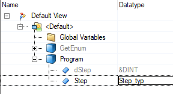
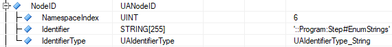
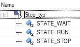

Package OpcEnum\
Libraries used : AsOpcUac, AsOpcUas\
Task used : GetEnum, Program

PreConditions:\
Activate the OPC-UA System in the CPU configuration.\
Enable the variable Step from program Program in the OPC UA default view file OpcUaMap.uad.

Task GetEnum:\
Used function and function blocks:\
UaSrv_GetServerState()
UA_Connect (fbConnect)
UA_NodeGetHandle (fbHandle)
UA_Read (fbRead)
UA_Disconnect (fbDisconnect)

Most of the parameters of the function blocks are defined in the GetEnum.var file.

The String for reaching the EnumStrings is '::Program:Step#EnumStrings'.

This string is independent of the used Information model

It is also possible to use a browse path with the UA_TranslaterPath function block, to get the node id, but this browse path is different when another Information model is used.
Information model 1 : '/0:Objects/4:PLC/6:Modules/6:&:&:/6:Program/6:Step/0:EnumStrings';\
Information model 2 : '/0:Objects/4:PLC/4:Modules/6:&:&:/6:Program/6:Step/0:EnumStrings';\

Task Program
Contains variable Step of Enumtype Step_typ with 3 enums: STATE_WAT, STATE_RUN and STATE_STOP.

The StepEnumStrings array of UALocalizedText, must have the **exact** length of the number of used enums in Step_typ.\
So in this case **UALocalizedText[0..2]**
