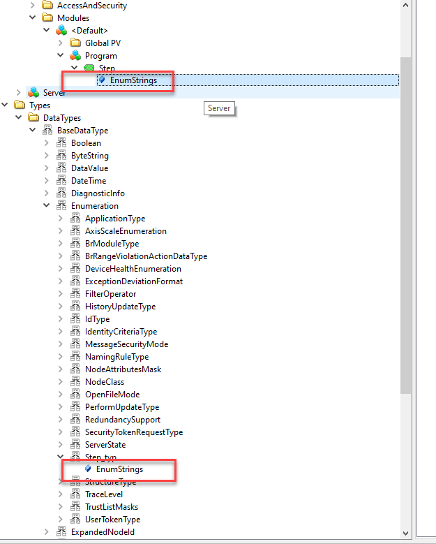

Package OpcEnum\
Libraries used : AsOpcUac, AsOpcUas\
Task used : GetEnum, ReadEnum, Program

PreConditions:\
Activate the OPC-UA System in the CPU configuration.\
Enable the variable Step from program Program in the OPC UA default view file OpcUaMap.uad.

Task GetEnum and ReadEnum both read the same information, but from different places in the plc information model.

Task GetEnum:\
Most of the parameters of the function blocks are defined in the GetEnum.var file.

The NodeID for reaching the EnumStrings is namespace 6 and String **'::Program:Step#EnumStrings'**.
This is done with the UA_NodeGetHandle function block which returns a NodeHdl.
This NodeHdl is used to read out the dimensions of this array of LocalizedText and subsequently the value of this array.

This string is independent of the used Information model.

It is also possible to use a browse path with the UA_TranslatePath function block, to get the node id, but this browse path is different when another Information model is used.\
Information model 1 RelativePath: **'/0:Objects/4:PLC/6:Modules/6:&:&:/6:Program/6:Step/0:EnumStrings'**\
Information model 2 relativePath: **'/0:Objects/4:PLC/4:Modules/6:&:&:/6:Program/6:Step/0:EnumStrings'**

There is a third possibility to read out the EnumStrings and this is with the data type.

This is done with the task ReadEnum.\
This task ReadEnum reads the DataType of '::Program:Step' variable. This information is returned as UANodeID.\
This information is then used in the UA_TranslatePath fub for the StartNodeID and the RelativePath is **'/0:EnumStrings'**.
The returned Nodehdl is used to read out the dimensions of this array of LocalizedText and subsequently the value of this array.

Task Program\
Contains variable Step of Enumtype Step_typ with 3 enums: STATE_WAT, STATE_RUN and STATE_STOP.

>**_Note:_** The StepEnumStrings array of UALocalizedText, must have the **exact** length of the number of used enums in Step_typ.\
So in this case **UALocalizedText[0..2]**. Otherwise error Bad_TypeMismatch 0x80740000 is generated.(The value provided for the attribute is not of the same type as the attribute's value. )
